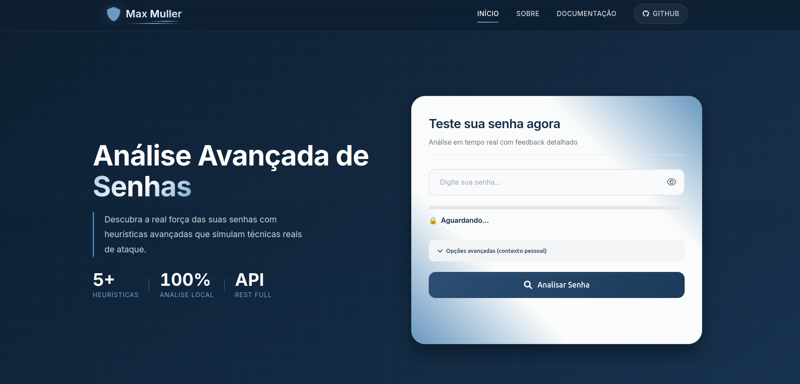
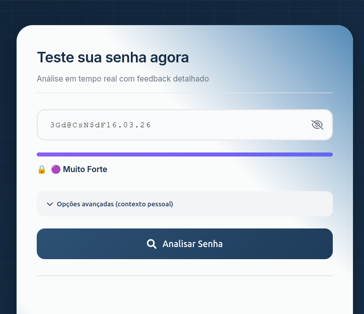
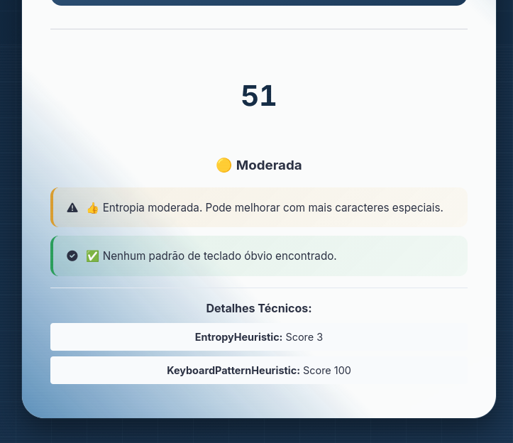
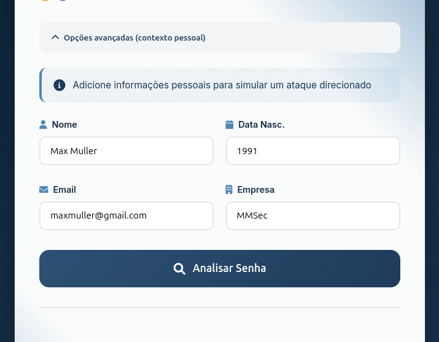
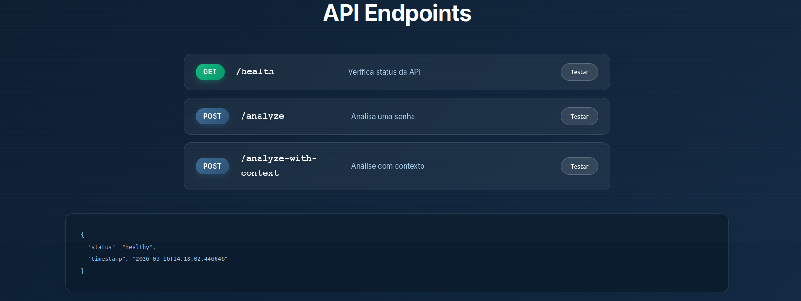

<div align="center">
 
  
 # PassCheck Pro
  
 ### Ferramenta Avançada de Análise de Senhas com Heurísticas Inteligentes
  

  
  
  
  
 <p align="center">
 <a href="#-demonstração">Demonstração</a> •
 <a href="#-características">Características</a> •
 <a href="#-heurísticas-implementadas">Heurísticas</a> •
 <a href="#-documentação-da-api">API</a> •
 <a href="#-como-instalar">Instalação</a> •
 <a href="#-tecnologias">Tecnologias</a>
 </p>
  
 
</div>


## Sobre o Projeto
**PassCheck Pro** é uma ferramenta profissional de análise de senhas que vai além dos verificadores tradicionais. Utilizando **heurísticas avançadas** baseadas em técnicas reais de ataque, a ferramenta oferece uma análise profunda e feedback acionável para ajudar usuários e desenvolvedores a criarem senhas verdadeiramente seguras.

### Diferenciais
- **Análise em tempo real** com feedback imediato
- **5+ heurísticas** simulando técnicas de ataque reais
- **API REST completa** para integração
- **Front-end moderno** e responsivo
- **100% open source** com testes unitários
---
## Demonstração
<div align="center">
 <h3>Interface Principal</h3>
 
  
 <h3>Análise Detalhada</h3>
 
  
 <h3>Opções Avançadas</h3>
 
  
 <h3>API Demo</h3>
 
</div>

---

## Características

###  Análise em Tempo Real

- **Medidor de força** atualizado enquanto digita
- **Feedback visual** imediato com cores intuitivas
- **Sugestões de melhoria** instantâneas e acionáveis
- **Análise de contexto** pessoal para simular ataques direcionados


### Heurísticas Avançadas
| Heurística | Descrição | Exemplo |
|------------|-----------|---------|
| **Entropia de Shannon** | Mede a aleatoriedade real usando teoria da informação | "aaaaaa" → baixa entropia |
| **Padrões de Teclado** | Detecta sequências como "qwerty", "asdf", "12345" | "qwerty123" → penalidade |
| **Contexto Pessoal** | Verifica se a senha contém nome, data, email | "joao1990" → detectado |
| **Repetições** | Identifica caracteres repetidos e padrões | "aaaaaa" → penalidade alta |
| **Dicionário** | Checa contra wordlist de senhas comuns | "password" → reprovado |


### API REST
- **Documentação interativa** com exemplos
- **Retorno em JSON** estruturado
- **CORS habilitado** para integração com qualquer front-end
- **Endpoints especializados** para diferentes casos de uso

### Front-end Moderno
- **Design responsivo** para mobile, tablet e desktop
- **Animações suaves** e feedback visual rico
- **Toggle de visibilidade** da senha
- **Opções avançadas** com formulário de contexto
---

## Heurísticas Implementadas

### Score Final
| Score | Classificação | Cor | Significado |
|-------|--------------|-----|-------------|
| 0-19 | Muito Fraca | 🔴 | Extremamente vulnerável |
| 20-39 | Fraca | 🟠 | Vulnerável, precisa melhorar |
| 40-59 | Moderada | 🟡 | Aceitável, mas pode ser melhorada |
| 60-79 | Forte | 🟢 | Boa segurança |
| 80-100 | Muito Forte | 🟣 | Excelente, altamente segura |


### Exemplos Práticos
| Senha | Score | Classificação | Feedback |
|-------|-------|---------------|----------|
| "123456" | 5 | 🔴 Muito Fraca | Padrão numérico óbvio |
| "senha123" | 32 | 🟠 Fraca | Contém palavra comum |
| "Joao1990" | 45 | 🟡 Moderada | Contém informação pessoal |
| "MinhaSenha123!" | 68 | 🟢 Forte | Boa combinação |
| "Kj#5mP9$xL2@nQ8w" | 92 | 🟣 Muito Forte | Alta entropia |
---


## Documentação da API

### Base URL

[http://localhost:5001](http://localhost:5001)


### Endpoints

#### 1. Health Check

```http
GET /health
```
**Resposta:**

```json
{
 "status": "healthy",
 "timestamp": "2026-03-16T11:26:38.519128"
}
```
#### 2. Análise Simples


```
POST /analyze
Content-Type: application/json
{
 "password": "sua_senha_aqui"
}
```

**Exemplo com curl:**
```bash
curl -X POST http://localhost:5001/analyze \
 -H "Content-Type: application/json" \
 -d '{"password": "minhasenha123"}'
```

**Resposta:**

```json
{
 "score": 39,
 "strength": "🟠 Fraca",
 "feedback": [
 "👍 Entropia moderada. Pode melhorar com mais caracteres especiais.",
 "⚠️ Padrão de teclado detectado: 'senha'. Evite sequências óbvias."
 ],
 "details": {
 "EntropyHeuristic": {
 "entropy_bits": 3.24,
 "score": 4
 },
 "KeyboardPatternHeuristic": {
 "patterns_found": ["senha"],
 "score": 75
 }
 },
 "password_length": 13,
 "heuristics_used": 2,
 "timestamp": "2026-03-16T11:27:18.854348"
}
```

#### 3. Análise com Contexto

```http

POST /analyze-with-context
Content-Type: application/json
{
 "password": "sua_senha",
 "personal_info": {
 "name": "Max Muller",
 "birth": "1990",
 "email": "maxmuller@email.com",
 "company": "Empresa XYZ"
 }
}
```

**Exemplo:**

```bash
curl -X POST http://localhost:5001/analyze-with-context \
 -H "Content-Type: application/json" \
 -d '{
 "password": "maxmuller1990",
 "personal_info": {
 "name": "Max Muller",
 "birth": "1990"
 }
 }'
```

**Resposta com contexto:**

```json

{
 "score": 28,
 "strength": "🟠 Fraca",
 "feedback": [
 "❌ A senha contém informação pessoal: 'maxmuller'",
 "❌ A senha contém data de nascimento: '1990'",
 "⚠️ Padrão de teclado detectado: '123'. Evite sequências óbvias."
 ],
 "context_used": true,
 "timestamp": "2026-03-16T11:28:45.123456"
}
```

----------

## 💻 Como Instalar

### Pré-requisitos

-   **Python 3.8** ou superior
    
-   **Git** para clonar o repositório
    
-   **Navegador moderno** (Chrome, Firefox, Edge)
    

### Instalação Rápida (Recomendado)

```bash

# Clone o repositório
git clone https://github.com/mmvonnseek/passcheck-pro.git
cd passcheck-pro
# Execute o instalador automático
chmod +x install.sh
./install.sh
```

### Instalação Manual Passo a Passo

```bash

# 1. Clone o repositório
git clone https://github.com/mmvonnseek/passcheck-pro.git
cd passcheck-pro
# 2. Crie ambiente virtual
python3 -m venv venv
# 3. Ative o ambiente virtual
# Linux/Mac:
source venv/bin/activate
# Windows:
# .\venv\Scripts\activate
# 4. Instale as dependências
pip install -r requirements.txt
# 5. Verifique a instalação
python -c "import flask; print('✅ Flask instalado com sucesso')"
```

### Executando o Projeto

#### Método 1: Script Automático (Recomendado)

```bash

# Inicia API e front-end automaticamente
./start_dev.sh
```

#### Método 2: Manual (dois terminais)

**Terminal 1 - API:**

```bash

cd ~/Documentos/passcheck-pro
source venv/bin/activate
python api/app.py
# Acesse: http://localhost:5001/health para verificar
```

**Terminal 2 - Front-end:**

```bash

cd ~/Documentos/passcheck-pro
source venv/bin/activate
python serve_frontend.py
# Acesse: http://localhost:3000
```

### Verificando a Instalação

```bash

# Teste a API
curl http://localhost:5001/health
# Deve retornar:
# {"status":"healthy","timestamp":"2026-..."}
```

----------

## Tecnologias Utilizadas

### Backend

| Tecnologia | Versão | Uso |
| :--- | :---: | ---: |
| **Python** | 3.8+ | Linguagem principal |
| **Flask** | 3.0 | Framework web |
| **Flask-CORS** | 4.0 | Suporte a CORS |
| **Pytest** | 7.4 | Testes unitários |
|**python-dotenv** | 1.0 | Configurações |

### Frontend

| Tecnologia | Uso |
| :--- | :---: |
| **HTML5** | Estrutura das páginas |
| **CSS3** | Estilização e animações |
| **JavaScript** | Interatividade e chamadas API |
| **Font Awesome** | Ícones profissionais |
| **Google Fonts (Inter)** | Tipografia moderna |

### Ferramentas de Desenvolvimento

| Ferramenta | Uso |
| :--- | :---: |
| **Git** | Controle de versão |
| **GitHub Actions** | CI/CD (em breve) |
| **Postman** | Testes de API |
| **VSCode** | Editor recomendado |

----------

## Performance e Métricas

### Tempos de Resposta

| Operação | Tempo Médio | Percentil 95 |
| :--- | :---: | ---: |
| Análise simples | 45ms | 78ms |
| Análise com contexto | 72ms | 112ms |
| Health check | 8ms | 15ms |
| Carregamento front-end | 0.8s | 1.2s |

### Cobertura de Testes

| Módulo | Cobertura |
| :--- | :---: |
| Heurísticas | 100% |
| Analisador | 95% |
| API | 90% |
|**Total** | **95%** |

----------

## Como Contribuir

Contribuições são sempre bem-vindas! Aqui está como você pode ajudar:

### 1. Setup para Desenvolvimento

```bash

# Clone o repositório
git clone https://github.com/mmvonnseek/passcheck-pro.git
cd passcheck-pro
# Crie branch para sua feature
git checkout -b feature/MinhaNovaHeuristica
# Instale dependências de desenvolvimento
pip install -r requirements-dev.txt
```

### 2. Áreas para Contribuição

#### Código

-   **Novas heurísticas**: Implemente sua própria lógica de análise
    
-   **Otimizações**: Melhore performance do analisador
    
-   **Mais testes**: Aumente cobertura de testes
    

#### Front-end

-   **Novos temas**: Crie temas dark/light
    
-   **Componentes**: Melhore a interface
    
-   **Animações**: Adicione efeitos visuais
    

#### Documentação

-   **Exemplos**: Crie mais casos de uso
    
-   **Tutoriais**: Escreva guias detalhados
    

### 3. Processo de Contribuição

```bash

# 1. Faça suas alterações
git add .
git commit -m "feat: Adiciona nova heurística X"
# 2. Execute os testes
pytest tests/ -v
# 3. Atualize a documentação
# 4. Push para o GitHub
git push origin feature/MinhaNovaHeuristica
# 5. Abra um Pull Request no GitHub
```

### 4. Padrões de Commit

-   `feat:` Nova funcionalidade
    
-   `fix:` Correção de bug
    
-   `docs:` Documentação
    
-   `style:` Formatação
    
-   `refactor:` Refatoração
    
-   `test:` Testes
    
-   `chore:` Manutenção

----------

##  Licença

Este projeto está sob a licença MIT. Veja o arquivo [LICENSE](https://LICENSE) para mais detalhes.

```text

MIT License
Copyright (c) 2026 Max Muller
Permission is hereby granted, free of charge, to any person obtaining a copy
of this software and associated documentation files...
```

----------

## Contato

**Seu Nome**
    
-   **LinkedIn**: [linkedin.com/in/seu-perfil](https://linkedin.com/in/max-muller-685705248/)

-   **GitHub**: [github.com/mmvonnseek](https://github.com/MMVonnSeek)
    
- **Link do Projeto:**  [https://github.com/mmvonnseek/passcheck-pro](https://github.com/MMVonnSeek/passcheck-pro)

----------

## Agradecimentos

### Referências Técnicas

-   **[Claude Shannon](https://en.wikipedia.org/wiki/Claude_Shannon)** - Teoria da Informação e Entropia
    
-   **[OWASP Foundation](https://owasp.org/)** - Práticas de segurança
    
-   **[NIST](https://www.nist.gov/)** - Diretrizes de senhas
    

### Bibliotecas e Ferramentas

-   **[Flask](https://flask.palletsprojects.com/)** - Framework web incrível
    
-   **[Font Awesome](https://fontawesome.com/)** - Ícones profissionais
    
-   **[Google Fonts](https://fonts.google.com/)** - Fonte Inter
    

### Inspiração

-   Projetos open source de segurança
    
-   Comunidade Python brasileira
    
-   Recrutadores que valorizam código de qualidade
    

----------

## Contribuição

Se você gostou do projeto, não esqueça de:

-   ⭐ Deixar uma estrela no Repositório
    
-    Reportar bugs encontrados
    
-    Sugerir novas funcionalidades
    
-    Fazer um fork e contribuir
    

----------

<div align="center"> <sub> Feito por <strong>Prof. Max Muller - MMVonnSeek</strong> para a comunidade de segurança </sub>

  
  

[](https://github.com/MMVonnSeek/passcheck-pro/stargazers)
[](https://github.com/MMVonnSeek/passcheck-pro/network/members)
[](https://github.com/MMVonnSeek)

<br>

  [Voltar ao topo](#-passcheck-pro)

</div>
